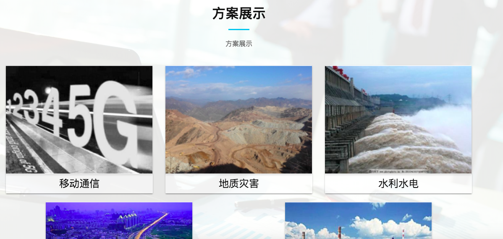

# 主页

此章节是讲述有关主页页面的内容管理操作

---

## 开始设定

* 点击进入cms的主页

  

  

* 创建新的主页设定，已设定里部分默认内容，可以参考
* 之后，进入该主页编辑界面

----

## 公司介绍

在以上可以一一对应相应的内容，并更改

----

## 解决方案

----

## 新闻中心

----

## 方案展示

---

## 新闻 2

----

## 团队（可选）

* 团队成员必须已经存在团队的数据库里面，才能在这里选择对应的团队成员
* 如果想清除，点击成员右边的x符号，删除显示。
* 如果四个成员格都没有选择团队成员，那么该整个团队章节不会显示。

----

## 联系我们

