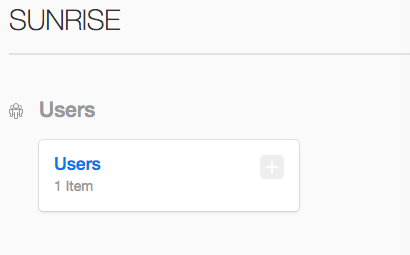

# 更新 2019-03-11

v0.86

* 更新数据库备份和恢复文档， 方法

# 开始

此处是文档说明后台内容系统， 此文档版本v0.85， 覆盖80%的主要功能介绍及使用。剩余部分会在未来一周内添加。如有任何bug或者修改意见, 请整理成文档及时联系本人。

* 不包括：顶部导航栏编辑， 底部导航栏编辑， landing 页编辑
* 需完善： 初始时，管理组用户可非命令行创建

---

## 登录

* 官网 url: http://47.75.124.142:8080
* CMS url: http://47.75.124.142:8080/keystone/
* Username: demo@gmail.com
* password: demo

--------------------------------------------

## 管理组用户

 1. 点击进入管理人员的组

    

2. 这里是管理admin的界面
   * 点击Admin User, 可以进入管理该管理账户的信息， 功能如下：
      	1. 管理账户显示名， 只有显示作用
      	2. 管理用户邮箱， admin邮箱
         	3. 可更改登录密码
            	4. Can access Keystone: 应一直为打勾状态
   * 创建新管理账户， 点击create user，

