# 解决方案-页面

该章节包括两个部分， 解决方案主页和具体解决方案内容页面

---

## 解决方案-主页

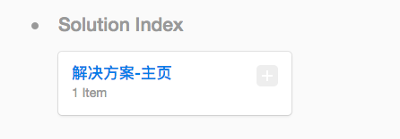

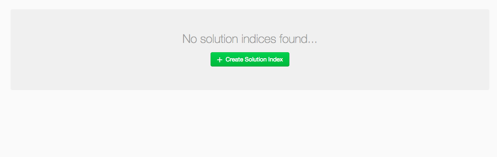

* 点击创建新的解决方案-主页

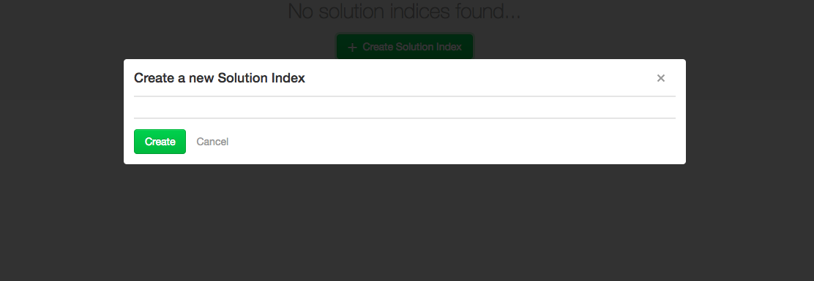

---

## 解决方案-主页-上半部

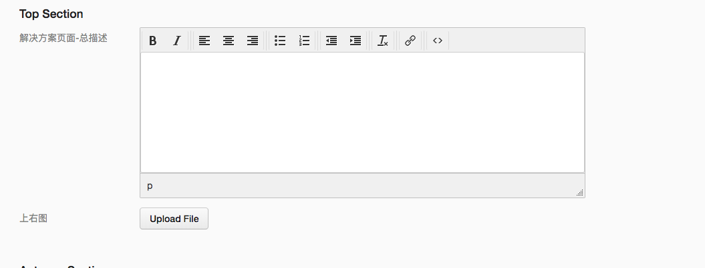

---

## 解决方案-主页-下半部

* 这里如果不设定，会有默认图片和文字添加进去。

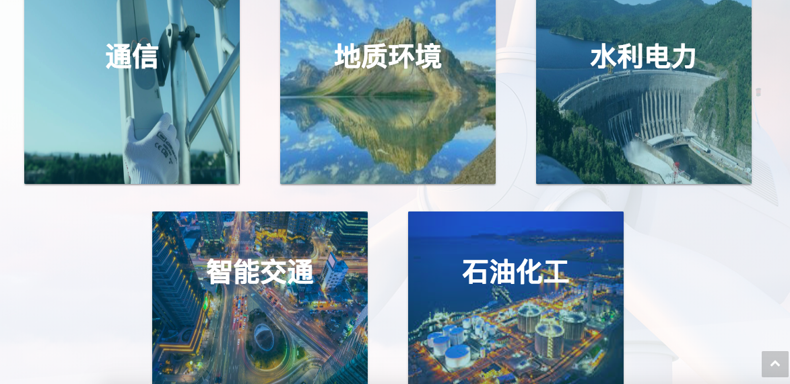

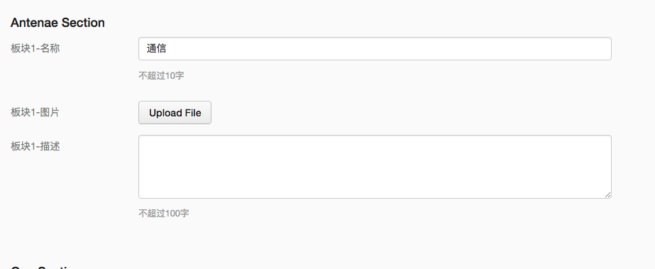

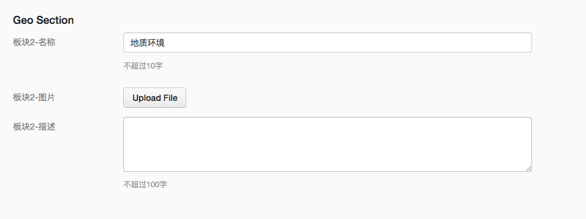

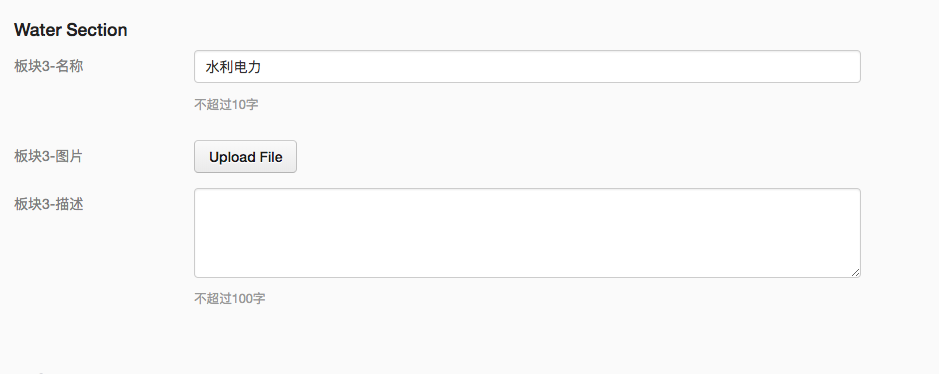

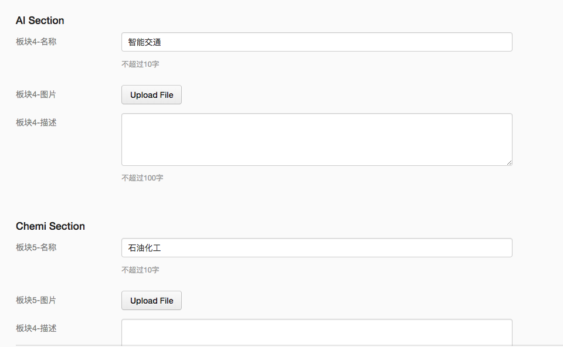

---

## 子页面1-通信页面

通信页面分成三个部分， 通信页面， 通信产品系列， 通信其他产品

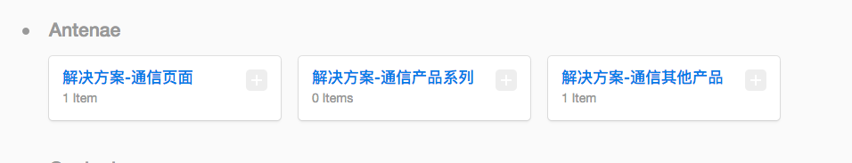

1. 通信页面是设置通信子页面

* 默认值如下

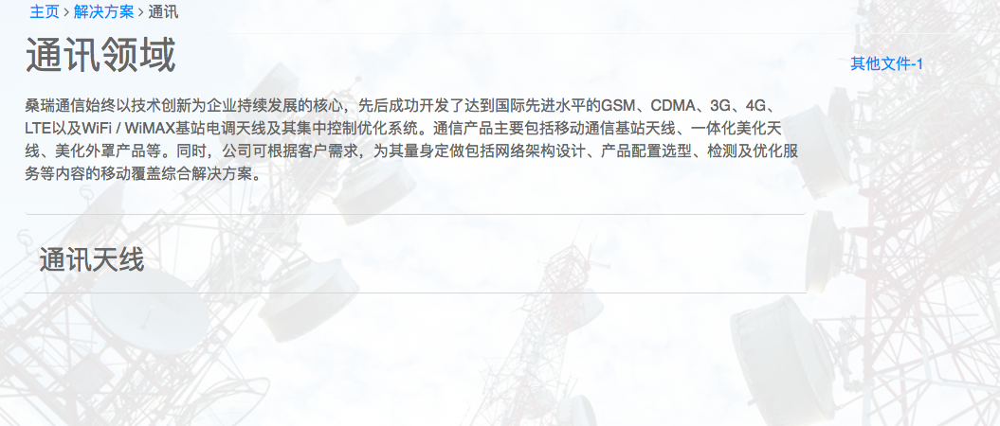

* 创建新子通信页面，默认值如下：

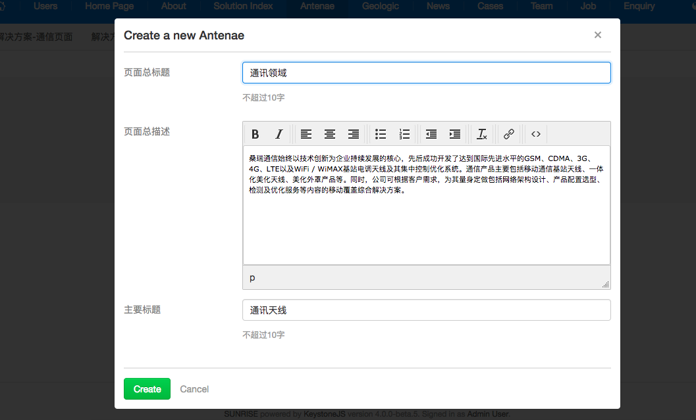

2. 设定通信产品系列

   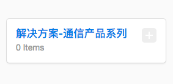

   * 进入添加，编辑通信产品. 每次添加一个产品，是添加一个产品信息，并会自动在前端显示

     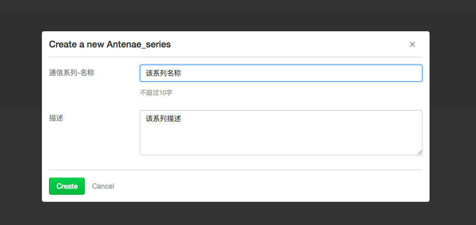

     * 可编辑改产品名称，描述，显示背景图片，可下载文件

     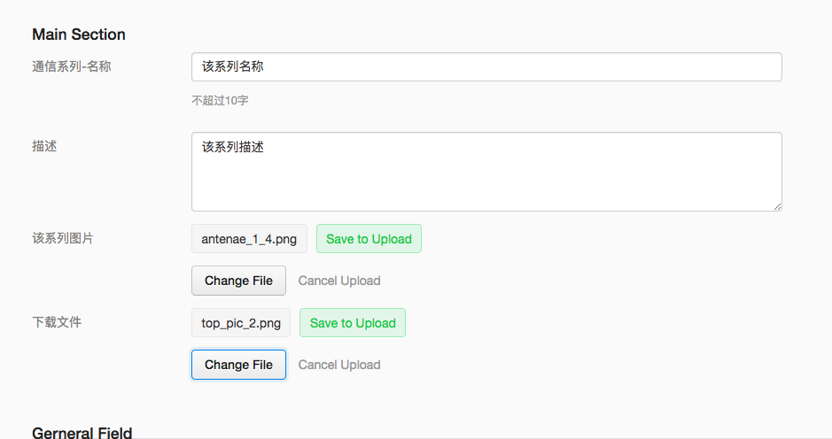

   * 效果如下

     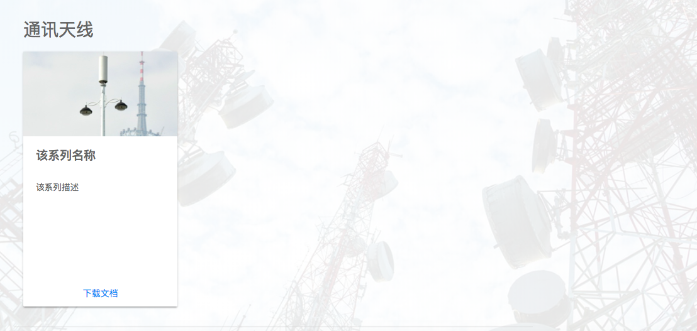

3. 设定通信产品其他系列

   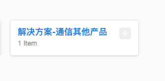

* 创建一个其他系列的产品

  

* 编辑产品名称，下载文档

  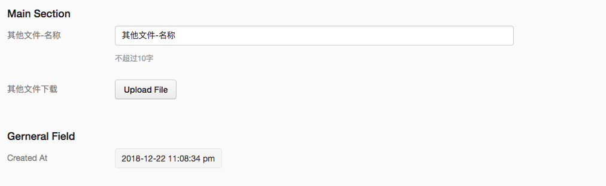

* 效果可见以下图片右边, 其他文件

  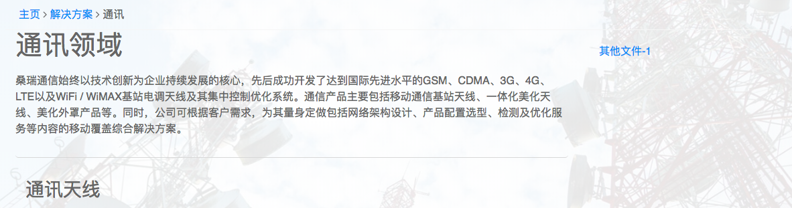

---

## 子页面2-雷达页面

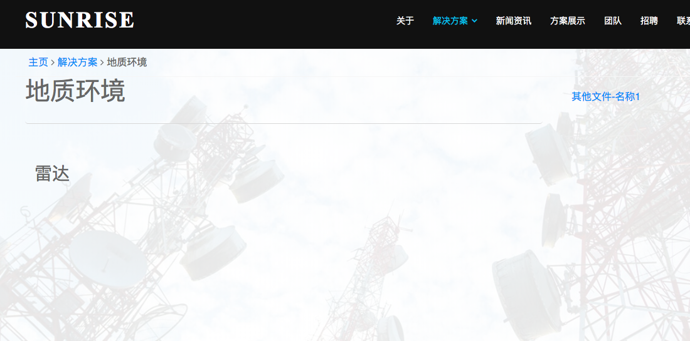

* 具体设置和以上通信系列设定一样...